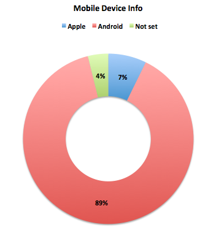

# Aplicación financiera

## Financial App: “Tus Finanzas”

### Preambulo:

El banco más importante del país ha lanzado una nueva aplicación móvil al mercado para que sus usuarios puedan visualizar sus gastos mensuales y fomentar el ahorro. Luego de tener algunos meses en el mercado y algo de tracción, el equipo detrás de este nuevo producto ha decidido contratar a una agencia/consultora de UX que los ayude a definir la dirección y evolución del producto. Tu eres empleada de esa agencia/consultora te asignan el proyecto.

### Objetivos Iniciales
-	Definir  la dirección y evolución del producto mínimo viable ("Tus finanzas").
-	Testear e Identificar problemas que posee la app actualmente.
-	Rediseñar prototipo navegable actual.

### Recursos 

Para comenzr a entender el problema y comenzar a trabajar nos proporcionaron la siguiente documentación:

-	Los user persona primario y secundario del proyecto
-	Los user flows iniciales y actuales del proyecto del MVP
-	El diseño del app en Figma , con una guía de componentes y el Prototipo navegable
-	Funnel Analytics de los primeros 6 meses del MVP
-	Data de uso del MVP de los primeros 6 meses
-	Landing Page inicial del producto
	
### Proceso de trabajo para rediseño

### Investigación:

#### Problemas encontrados y análisis de datos:
 

Según los datos analizados, en el leading page podemos ver que hubo un crecimiento de visitas de un 74% duranto los 6 meses de lanzamiento del producto pero esto no se ve reflejado en los graficos de app store, instalaciones y sing ups

 
Las visitas a la app store se ven reflejadas con un 12,4 % con respecto al laading page, mientras que el 12,8% instala la app una ves vista en el app store, y a su vez solo el 8,4% hace sings up en la app.

Tambien podemos ver que las personas se interesaron mucho más en revisar sus gastos que sus ahorros, ya dentro dde la app

 
Además podemos ver que 89% de los usuarios adroid se interesaron en la app v/s 7% de los usuarios iOS lo que es un gran oportunidad para ampliar el negocio.
 
 

##### Conclusión:

Alguno de los problemas visualizados se encuentra en el leading page la cual no aclara que la aplicación es solo para dispositivos IOS.

La mayor cantidad de usuarios que se interesó en la aplicación son usuarios Android por lo que una de las recomendaciones de rediseño será ampliar el alcance y que llegue a todos los usuarios.

También se ve que el fomento del ahorro no se está logrando con la aplicación, ya que no es claro este paso dentro de la navegación, por lo que también es una oportunidad de rediseño.

#### Entrevista al cliente: 

Se entrevisto al cliente, José Tomás Loayza, a traves de una llamada telefónica, en la cual se le hicieron las siguientes preguntas:

1.	¿La app es únicamente para clientes afiliados  al banco ? ¿O te gustaría que cualquier usuario pudiese usarla ? 

      R: La app es solo para clientes del banco, es posible que en un futuro la app pueda venderse quizás a otros bancos, si llega a ser lo suficientemente buena para esto.

2.	¿Cual es su público objetivo? 

      R: El publico objetivo es el que mostramos en los user persona, pero si dentro de la investigación se ve otros usuarios puedes proponerlos.

3.	¿Cuales son sus objetivos principales con respecto a la aplicación? 

      R: Captar al cliente del banco y que use la aplicación en la que pueda tener lo que necesita.

4.	La app está disponible solo para usuarios IOS, está dentro del presupuesto ampliar esto a usuarios Android?

      R: Si por supuesto, mientras todo este justificado en el rediseño, se puede ampliar.

5.	Cómo pretenden fomentar aún más el ahorro en la app? Alguna motivación por ahorro?

      R: Qué la aplicación ayude de manera dinámica a los usuarios, pero no estamos pensando en una motivación monetaria, si no más bien que dentro de la app sea algo entretenido y que pueda visualizar sus objetivos de ahorro y lograrlos.

#### Encuesta a usuarios:

Se realizo una encuesta a los usuarios de productos bancarios a traves de [Google Forms](https://docs.google.com/forms/d/1WFxVdP-ZanVVl5TFcqQlGxC4J0-XJ37lYXnvHJ3-oLo/edit).

#### Testing prototipo navegable

Se realizó testing del prototipo navegable a 6 usuarios para identificar oportunidades y problematicas de la aplicación actual, el que ayudó a entender que el registro es bastante engorroso para el usuario, ya que hubo un 50% de rebote.
Hubo además un 75% de rebote en cuanto a la tarea "agregar un nuevo ahorro", lo que se entiende que el flujo no es claro y provoca confusión en el usuario no dejandolo terminar la tarea.
El 75% de los usuarios tampoco pudo realizar todas las tareas esperadas con respecto a "movimientos" o "gastos", y dejaron la aplicación antes de lograrlo, ya sea por no entender el menú flotante o por falta de información con respecto al flujo de esta.

 
#### Bechmark:

Se revisaron referentes de 4 aplicaciones para ver su forma de funcionamiento, como interactua el usuario con ellas y su funcionalidad.

### Recomendaciones de rediseño

Como ya se comentó anteriormente hay una gran oportunidad de ampliar el rango de usuarios que se interese en la aplicación y la puedan instalar y usar de manera fácil y confiable, pues gracias a la data podemos notar que existe esta necesidad, lo que ayudaria bastante a fidelizar mas usuarios. Además de fomentar de una manera dinámica el ahorro para poder facilitar esta tarea y ayudar al usuario a recordar como hacerlo de la mejor manera indicandole cuanto es lo que puede llegar a gastar por día dependiendo de la meta que desea alcanzar. 
Por lo tanto el rediseño se basará en que sea: 
- Amigable 
- Confiable 
- Que sea para todo dispositivo
- Que ayude a fomentar de manera real el ahorro
- Atractiva visualmente
- Funcional

### Rediseño

#### Scketch

Luego de realizar la investigación se comenzó a rediseñar comenzando por un prototipo de baja fidelidad.

#### Figma

[Figma](https://www.figma.com/proto/JmXHj8bkwkFIUATXqMeulWZd/Tus-Finanzas?node-id=1%3A2&scaling=scale-down)

### Zeplin

[Zepling](https://app.zeplin.io/project/5c7e87a1fd01aebc606e63bd)

### Próximos desarrollos

Dentro de los pórximos desarrollos se contempla:

- Testear: Testear prototipo de alta fidelidad para lograr que la aplicación sea lo más cercana al usuario posible.

- Chatbox: Para ayudar al usuario en tiempo real sobre cualquier duda que tenga con respecto a sus cuentas.

- Ahorro más interactivo y educativo para que sea mucho más fácil poder lograr las metas de ahorro.

- Huella digital: Para que el usuario tenga la posibilidad de que tan solo con su huella pueda hacer distintas transacciones o movimientos dentro de sus cuentas en la aplicación.

- Agregar cuenta: Se estima poder unificar todas las cuentas del banco en una sola aplicación para que además estas se puedan visuzalizar de manera rápida y poder interactuar entre ellas.

## Anéxos

### Planificación

[Link Planificación]()

